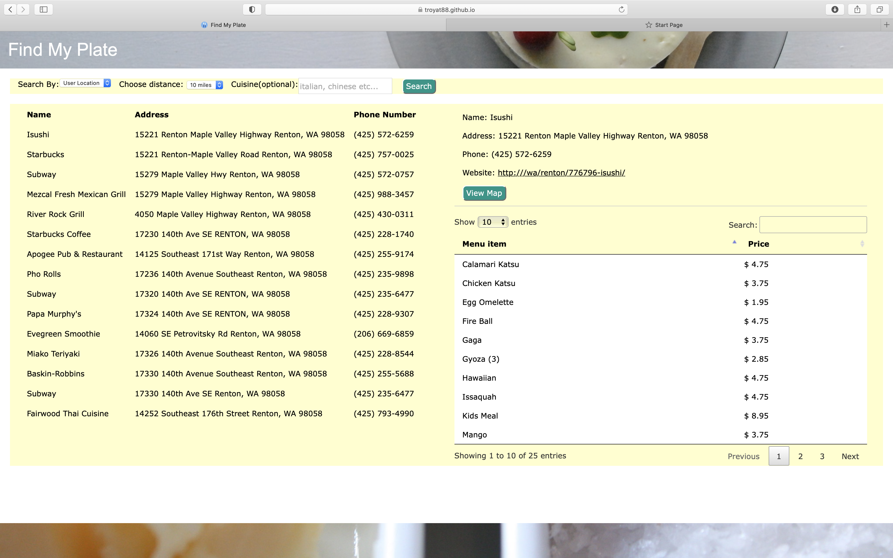

# Find-My-Plate
Group Project 1
Team Members: Derrick Nguyen, Victor Lam, Alex Carmody, Troy Atkinson

### Team Objective 
Out Challenge as a team is to develope and deploy a client side application in two weeks. 

### Team Criteria 
1. Integrate data from two server side APIs
2. Use a CSS framework other than Bootstrap
3. Use one Git-Hub repository for the team
4. Manage project workflow by implementing Scrum Methodology and Agile Principles

---

## Find My Plate 
An easy to use application that allows you to search a desired area for dining options.

### User Story
As a diner, I want to be able to find restaurant options near me or somewhere I am planning to be. I also want to filter those options by type of cuisine. If  viewing a menu, I want to be able to search that menu quickly and easily. 

### Acceptance Criteria
Given a site with inputs for location, distance and cuisine: 
WHEN I search for my current location and specify a distance from, THEN I am presented with restaurants within specified vicinity
WHEN I select a restaurant, THEN I am presented with a restaurants details (address, website, phone) a menu, and the option to view its location on Google Maps
WHEN I type a menu item in the menu-search, THEN I am presented with all items that contain what I typed
WHEN I select "View-Map" for a restaurant, THEN I am presented with the location of the restaurant on Google-Maps
WHEN I search by zipcode, THEN I am presented with optional forms to search by restaurant name or cuisine
WHEN I search by restaurant name or cuisine, THEN I am presented with all options within that zipcode

## Process
1. Get access to DocuMenu and Google Maps API 
2. Create site using HTML and CSS via W3-CSS framework
3. Create Custom CSS to override defaults on W3-CSS
4. Creat scripts for API integration and functionality with Javascript and Jquery

Once the framework for the site was established, the team picked a feature to add (ex. search by zip code or display menu), altered the HTML and CSS as needed, developed fetch and dynamic display functions, tested the feature and debugged before proceeding to adding the next feature. This itterative process allowed the team to work together in an organized structure. 

As a team we used the start of class sessions to have a stand-up on what progress had been made individually as well as insights into debugging and improving the application as a a whole. This time was also used to commit and merge from local branches to the teams main branch. This was especially helpful in navigiating merger conflicts. 

 

